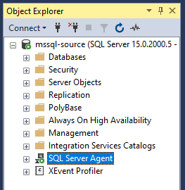
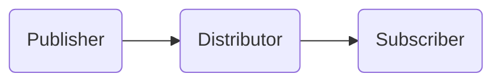
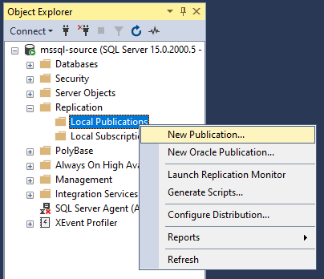
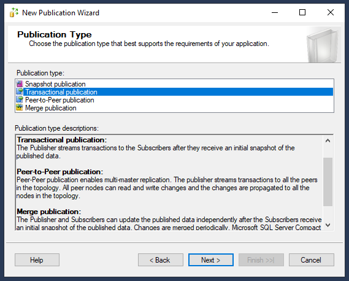
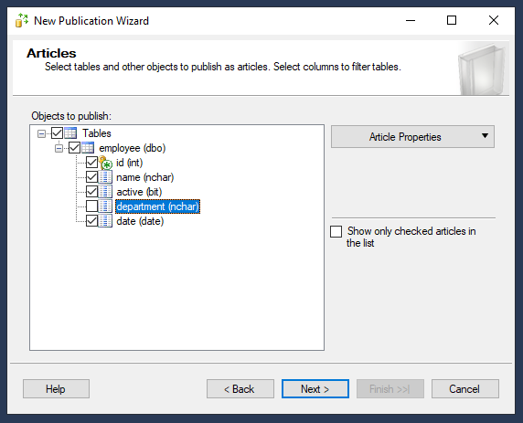
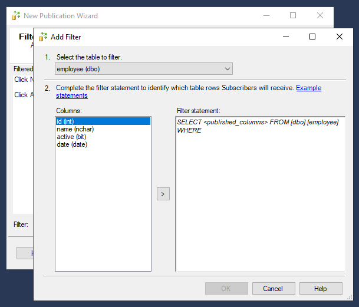
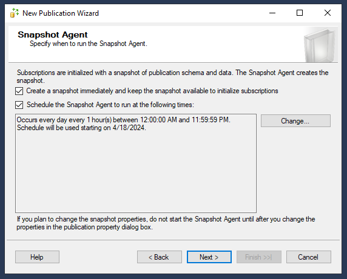
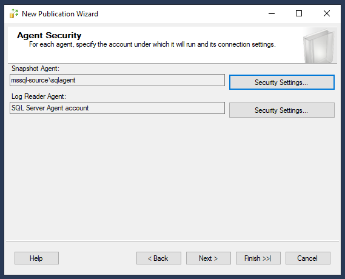
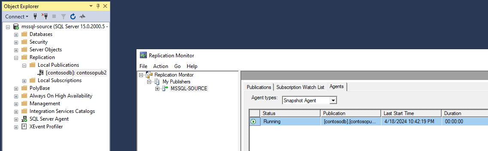
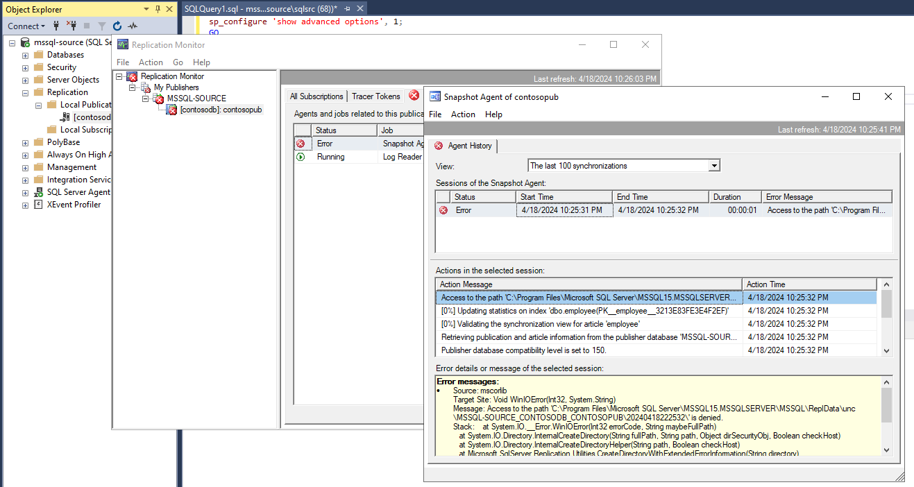

# Microsoft SQL Server Replication

Copy the template variables file:

```sh
cp config/template.tfvars .auto.tfvars
```

Set your IP address in the `allowed_ip_address` variable.

Create the infrastructure:

```sh
terraform init
terraform apply -auto-approve
```

## SQL Server installation

Select the respective SQL Server version. Evaluation links:

- [SQL Server 2022 Evaluation](https://www.microsoft.com/en-us/evalcenter/evaluate-sql-server-2022)
- [SQL Server 2019 Evaluation](https://www.microsoft.com/en-us/evalcenter/evaluate-sql-server-2019)

Create a new database to be used for replication. This procedure will use a new database `contosodb`.

If the Replication feature is not selected on installed, it need to be added using **SQL Server Installation Center**.

The installation media should be like this: `C:\SQL2019\Evaluation_ENU`.

Create a new local user with `Administrator` privileges that will be used for the replication agent. In production, check the documentation for a least-privilege approach.

Also, enable [Agent XPs][1] that will be required for replication (check the article version to match the installation version).

Make sure that the agent is running:



## Replication

With the Replication feature enabled, proceed the setup.

For testing purposes, the `Publisher` can act as its own `Distributor`.



Create a new Publication:



As the wizard will prompt:

- Select the data and database objects you want to replicate.
- Filter the published data so that Subscribers receive only the data that they need.

The Publication Type for this exercise will be **Transaction publication**.



A primary key is **mandatory** for transactional replication.



Filters may also be added to the replication settings:



Snapshots can be created to quick start new Subscriptions:



In the agent security step, select the user you previously created:



The replication monitor should display the status as **OK**.




## Troubleshooting



[1]: https://learn.microsoft.com/en-us/sql/database-engine/configure-windows/agent-xps-server-configuration-option?view=sql-server-ver15
