# Microsoft SQL Server Replication

Transactional replication sandbox from SQL Server to Azure SQL Database. The infrastructure template can support multiple replication architectures:

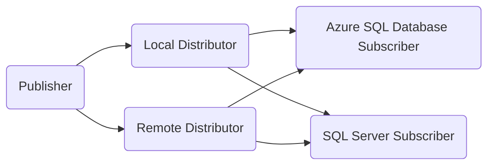

The implementation in this repository will focus on a remote Distributor with an Azure SQL Database as the Subscriber, with a private connection via Private Endpoints deployed to a connectivity Virtual Network with DNS integration:

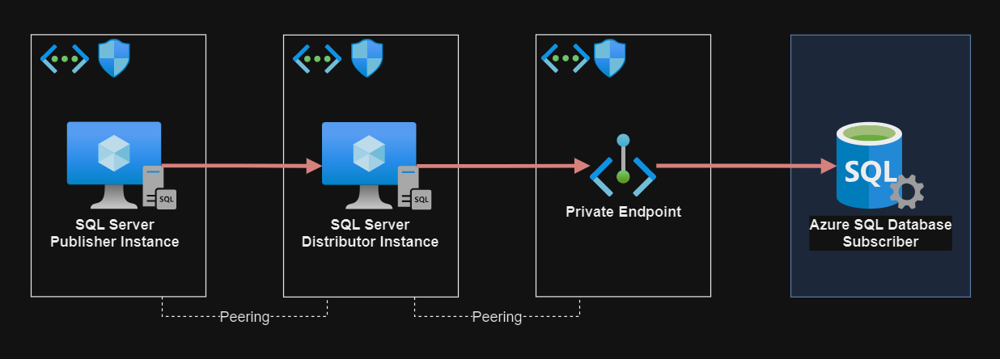

## Infrastructure

Copy the template variables file:

```sh
cp config/template.tfvars .auto.tfvars
```

👉 Set your IP address in the `allowed_ip_address` variable.

Create the infrastructure:

```sh
terraform init
terraform apply -auto-approve
```

Follow the documentation below to configure the SQL Server replication.

## SQL Server installation

Connect to the source and distributor SQL Server virtual machines.

Download and install the respective SQL Server version. Evaluation links:

- [SQL Server 2022 Evaluation](https://www.microsoft.com/en-us/evalcenter/evaluate-sql-server-2022)
- [SQL Server 2019 Evaluation](https://www.microsoft.com/en-us/evalcenter/evaluate-sql-server-2019)

If the Replication feature is not selected via custom installation, it needs to be added later using the **SQL Server Installation Center**. Make sure to install select the existing installation option.

The installation media should be located in this directory: `C:\SQL2019\Evaluation_ENU`.

Create new local users `<local system>\sqlserver` and `<local system>\sqlagent` with `Administrator` privileges that will be used for the replication agent service and the SQL Server service.

> 💡 In production, check the documentation for a least-privilege approach. Make sure to add the login and permissions to the user.

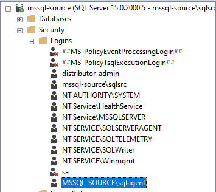

Setting up the SQL Server **AND** SQL Server Agent user account using the SQL Server Configuration Manager. Apply to restart the service.

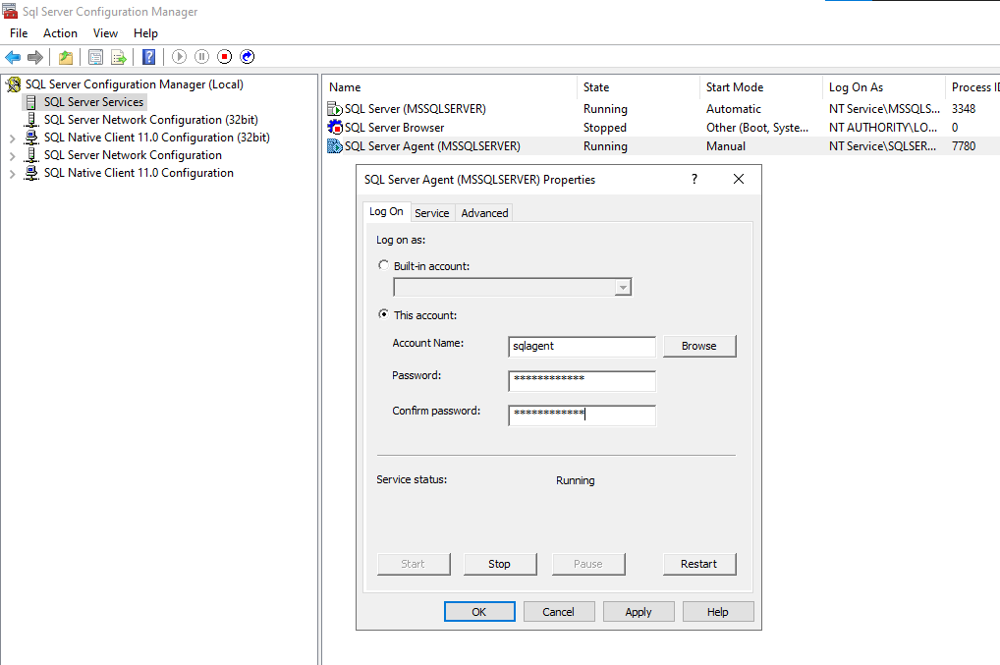

👉 Enable [Agent XPs][1] that will be required for replication (check the article version to match the installation version).

```sql
sp_configure 'show advanced options', 1;  
GO  
RECONFIGURE;  
GO  
sp_configure 'Agent XPs', 1;  
GO  
RECONFIGURE  
GO
```

Make sure that the agent is running before moving to the next steps:


### Remote connections

👉 Add a Windows Firewall rule on each server to accept connections in the 1433 port from remote.

Enabling remote connections require additional configuration:

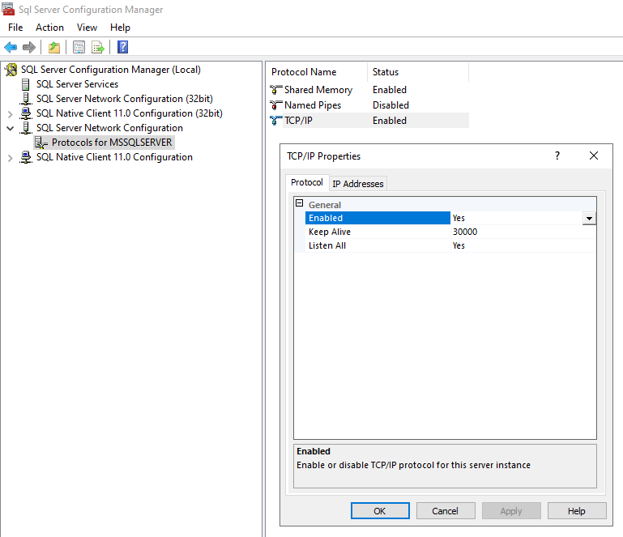

Create SQL authentication users to allow for:

1. Distributor to accept the source as Publisher
2. Publisher to connect to Distributor

> 💡 Recommended approach would be two-way domain trust with Integrated Authentication.

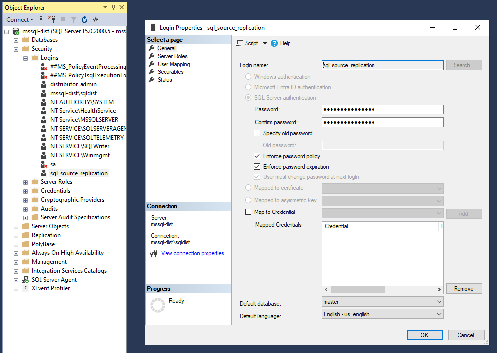

Allow both **SQL Authentication** and **Windows Authentication** modes:

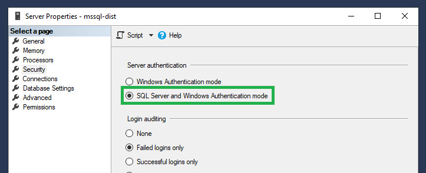

## Distributor

The SQL Server Replication feature must be installed to enable distribution, with an active SQL Server Agent.

The [Distributor][2] instance must be set as it's own distributor so it can be [used by the Publisher server][3].


Follow-up with the process of setting up the distribution:

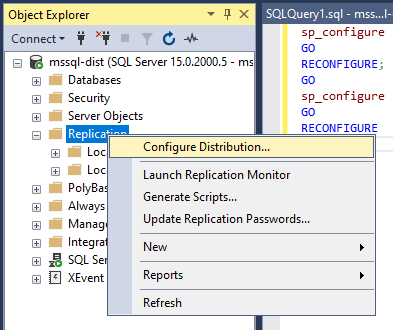

Since this instance role in the architecture is to be the Distributor instance, it will act as it's distributor:

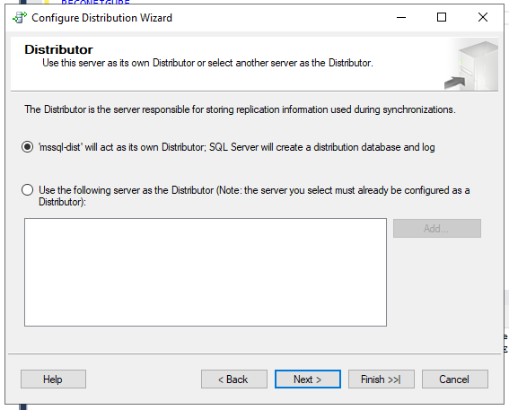

If the agent does not have enough permissions, it is possible to setup an account directly:

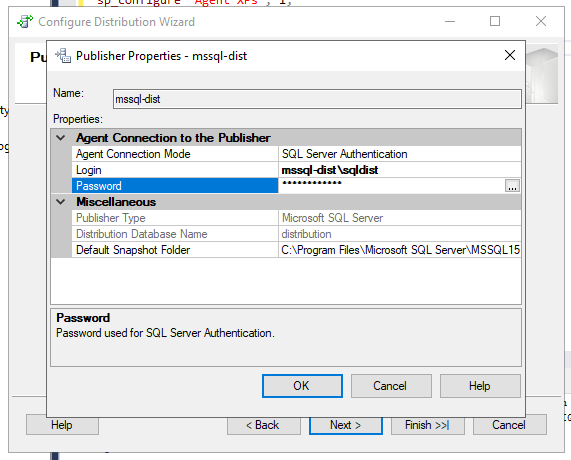

Confirm that when setting up the distribution, the **source** server is configured as Publisher.

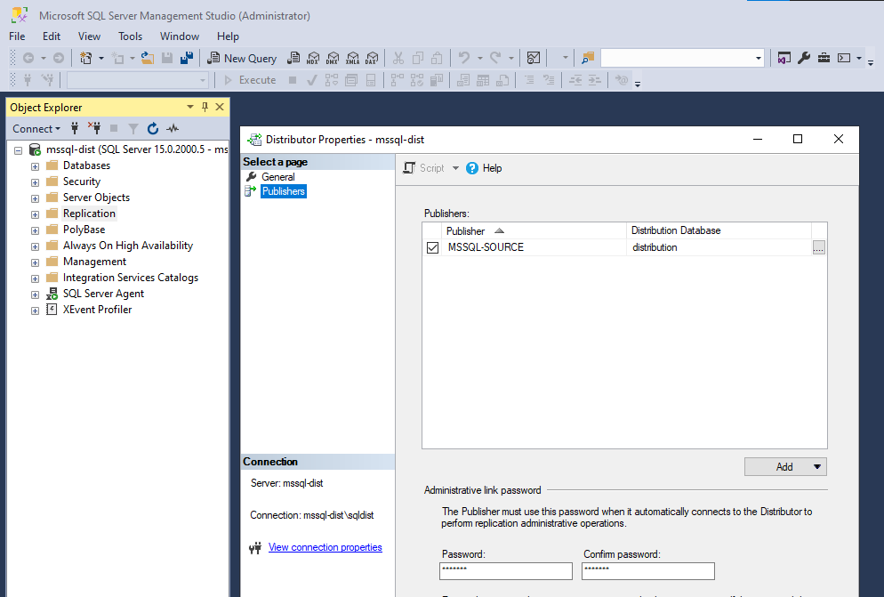


## Publisher

With the Replication feature enabled, proceed with the Publisher setup.

Create a new database to be used for replication. This procedure will use a new database `contosodb`. Create tables and and insert values to have some sample data. Refer to the [tsql](./tsql/) directory for examples.

The Distributor instance server must have been configured. For simpler setups the `Publisher` can act as its own `Distributor`.


Create a new Publication:


As the wizard will prompt:

- Select the data and database objects you want to replicate.
- Filter the published data so that Subscribers receive only the data that they need.

The Publication Type for this exercise will be **Transaction publication**.


The source server should use the remote distributor:

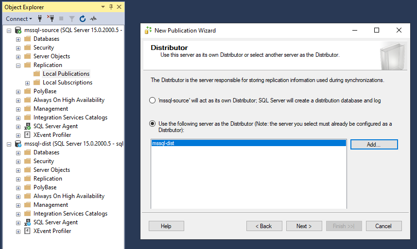

A primary key is **mandatory** for transactional replication.


Filters may also be added to the replication settings:


Snapshots can be created to quick start new Subscriptions:


In the agent security step, select the user you previously created:


The replication monitor should display the status as **OK**. Make sure to check all tabs.


## Subscription

This section will set up [replication][4] to the Azure SQL Database.

Add a new Subscriber and follow the wizard steps. Set the Azure SQL database information for the Subscriber. It must use SQL credentials. For the agent security, use the same user created for the distributor.

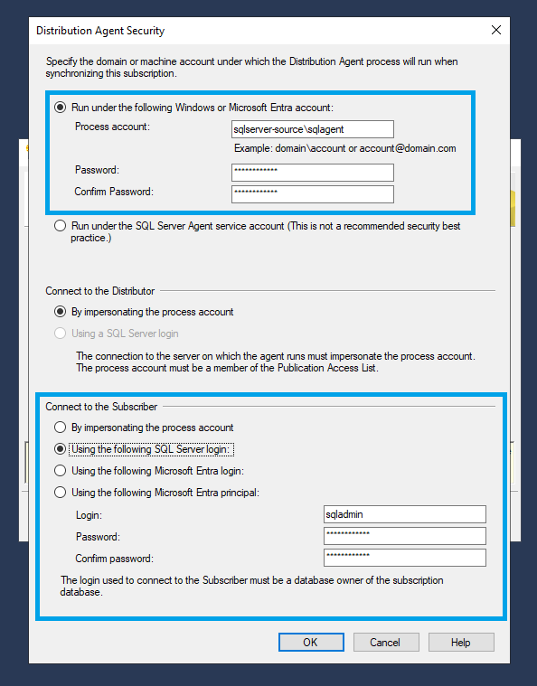

For real-time sync, select `Run continuously`:

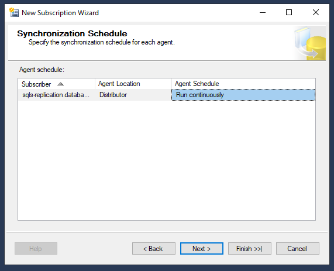

After setting it up, make sure to confirm the subscriber status is OK in the Replication Monitor:

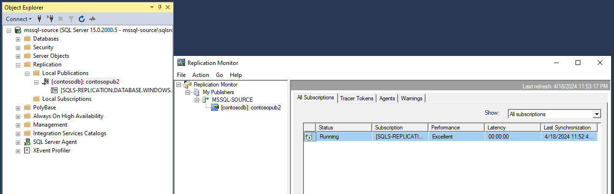

## Troubleshooting


[1]: https://learn.microsoft.com/en-us/sql/database-engine/configure-windows/agent-xps-server-configuration-option?view=sql-server-ver15
[2]: https://learn.microsoft.com/en-us/sql/relational-databases/replication/distributor?view=sql-server-ver16
[3]: https://learn.microsoft.com/en-us/sql/relational-databases/replication/configure-publishing-and-distribution?view=sql-server-ver16
[4]: https://learn.microsoft.com/en-us/azure/azure-sql/database/replication-to-sql-database?view=azuresql
